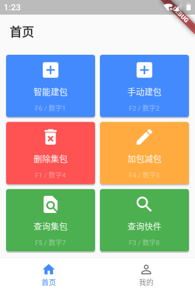

# sorting

分拣系统终端App。

## 项目介绍
### App截图

### App兼容适配设备
*kaicom-w571*  

### 功能简介
* 登录
    - 验证码验证
* 注册
* 忘记密码
* 应用设置
    - 服务器
    - 网点
    - 模式
    - 键盘配置
* 主功能
    - 智能建包
    - 手动建包
    - 删除集包
    - 集包加件减件
    - 查询集包
    - 查询快件
* 离线数据自动/手动同步  
    在连接不上服务器时，将 主功能 操作产生数据存储在本地数据库，在可连接服务器时（例如下次登录之后），自动上传离线数据。
* 全键盘操作  
    - OK键  
        用户按下OK键时，可以确定/执行/下一个输入。
    - 按键绑定  
        用户可以自定义功能与按键的绑定关系，
        之后在任意界面位置唤起功能屏。

### 开发
* App  
    关键字：Dart、Flutter、Material-design
* 后端  
    https://github.com/hulang1024/sortingserver